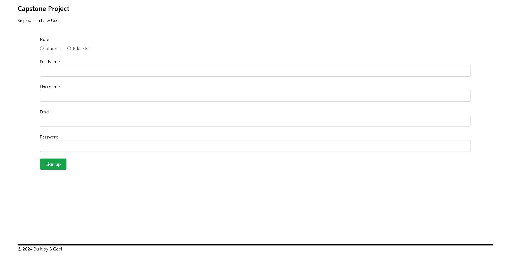
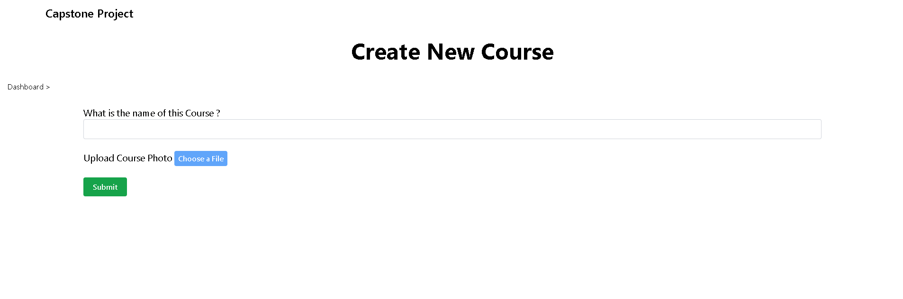

# Capstone Project
## Table of Contents

- [Overview](#overview)
- [Features](#features)
- [Installation](#installation)
- [Usage](#usage)
- [Screenshots](#screenshots)
- [Technologies Used](#technologies-used)
- [Live Demo](#live-demo)
- [Video Demo](#video-demo)
---

## Overview

**Capstone Project** is a web application built using Node.js that helps educator to publish their courses and student can learn them. The goal of this project is to promote knowledge sharing from teachers to students

## Features

- Feature 1: Authentication & Authorisation
- Feature 2: Creating a Course, Chapters, Pages & edit it (Educator only)
- Feature 3: Viewing the Courses, Chapters, after enrolling view the pages and mark as complete (Student only)

## Installation

Follow these steps to set up the project on your local machine:

1. **Clone the repository:**

   ```bash
   git clone https://github.com/sea-sgopi/CapstoneProject.git
   ```

2. **Navigate to the project directory:**

   ```bash
   cd CapstoneProject
   ```

3. **Install the required dependencies:**

   ```bash
   npm install
   ```

4. **Start the application:**

   ```bash
   npm start
   ```

5. Open your browser and go to `http://localhost:3000`.

## Usage

Once the application is running, you can access it at `http://localhost:3000`. The application allows users to create a Course, Chapters, Pages as a `Educator`. View the Courses, Chapters without enrolling the Courses, after enrolling to the courses `Student` can view the pages and mark as complete.

## Screenshots

Here are some screenshots of the application:

#### Home Page


#### Signup



#### Login


#### Change Password


#### Educator Dashboard


#### Create a Course



#### Create a Chapter


#### Create a Page


#### Student Dashboard


#### View Course


#### View Course after enrolled


#### View Pages


#### View Page-part1


#### View Page-part2


## Technologies Used

This project was built using the following technologies:

- **Node.js**: JavaScript runtime environment
- **Express.js**: Web framework for Node.js
- **Postgres**:  Database used for storing data
- **EJS**: Templating engine for rendering HTML views
- **HTML/CSS/JavaScript**: Frontend

## Live Demo

You can check out the live application here: [Live Demo](https://capstoneprojectatsgopi.onrender.com)

## Video Demo

You can check out the video here: [Video Demo]([https://capstoneprojectatsgopi.onrender.com](https://www.loom.com/share/a41397579c9749f3a51259e640a3010d?sid=bf9e1044-56ac-41d7-9dfc-f967561e2e7f))
